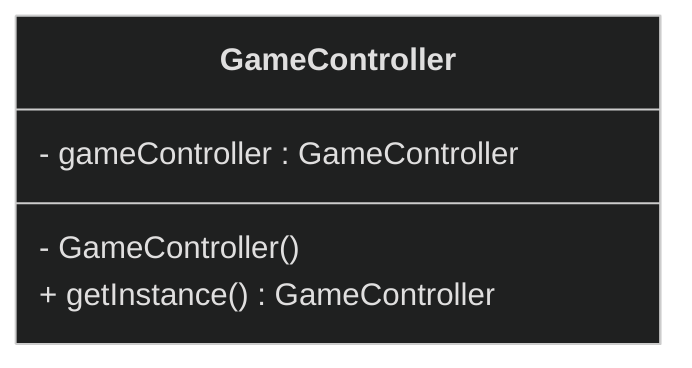

# Tema 4. Práctica


## Índice
1. [Enunciado](#punto1)
2. [Resolución](#punto2)
3. [Anotaciones](#punto3)
4. [Diagrama UML](#punto4)


<br><div id="punto1"></div>

## 1. Enunciado
Partiendo de la solución del ejercicio 11 de esta unidad, _abstract factory pattern, Enemy versión 1_, se pide modificarlo para que ambos mundos se puedan generar enemigos de forma aleatoria, con esto se podrán obtener enemigos de forma equiprobable en el mundo 1 y con mayor probabilidad de generar brujas, proporción del 75/25, en el mundo 2. Comprobad que se cumplen las proporciones adecuadas en cada mundo/nivel mediante un mensaje por consola en el método _play_. Se pide:
- Dibujar un nuevo diagrama UML con los cambios necesarios en el diseño de la solución anterior para que, mediante la aplicación del patrón de objeto único mediante **instanciación perezosa, Singleton pattern,** el objeto _GameController_ sea único y sea accedido desde la clase _Test_.
- Indicar los componentes que pertenecen al patrón de objeto único y patrón de factoría abstracta en el diseño final.
- Dada esta clase Test, _DaemonGameTest_, completa la línea de instanciación que permita acceder al objeto único de GameController.
    ```java
    package com.utad.patterns.abstractfactory.randomenemy;
    
    public class DaemonGameTest {
        public static void main(String[] args) {
            /*
                TODO Accede al objeto único aplicando
                patrón Singleton a GameController y 
                utiliza la instanciación en static
            */
            GameController game = ¿¿???
            game.play();
            /*
                Dentro del método play, implementa el
                código que permita confirmar que se
                cumplen estadísticamente las proporciones
                de enemigos en cada mundo
            */
        }
    }

<div class="page"></div><!-- PDF EXPORT -->

- Asegúrate que los valores numéricos de configuración de los _Demonios_ y _Brujas_, están definidos como constantes
- Muestra los resultados que obtienes por consola. Estos son unos posibles resultados que se pueden obtener por la consola:
    ```
    Empieza el juego en el Mundo 1

    Creamos un demonio en el mundo 1 World1Daemon [name=Daemon, power=10, lives=1, color=rojo]

    Creamos una bruja en el mundo 1 World1Witch [name=Witch, power=15, lives=2, magicPower=Magic wand]

    Cambiamos de mundo, pasamos al Mundo2

    Creamos un demonio en el mundo 2 World2Daemon [name=Big Daemon, power=20, lives=2, color=verdes]
    
    Creamos una bruja en el mundo 2 World2Witch [name=Big Witch, power=30, lives=4, magicPower=Magic wand and magic broom]
    
    Reiniciamos, pasamos al Mundo1
    
    Daemons (51), Witches (49) proportion of Daemons 51 %(rounded)
    
    Ejemplo de enemigo aleatorio en el Mundo1 
    
    World1Daemon [name=Daemon, power=10, lives=1, color=rojo]
    
    Cambiamos de mundo, pasamos al Mundo2
    
    Daemons (24), Witches (76) proportion of Daemons 24 %(rounded)
    
    Ejemplo de enemigo aleatorio en el Mundo2 
    
    World2Witch [name=Big Witch, power=30, lives=4, magicPower=Magic wand and magic broom]
    
    Juego finalizado
    ```


<br><div class="page"></div><!-- PDF EXPORT -->

<div id="punto2"></div>

## 2. Resolución
Primero configuraremos la clase _GameController_ para que siga el patrón _Singleton_, cuya estructura UML es la siguiente (se han omitido algunos métodos por cuestiones de espacio, en el repositorio están los resultados completos):


Importante, para este patrón, tanto el constructor como el atributo en sí mismo que sigue el formato Singleton, que en este caso es _GameController_, deben estar en privado. Dado que no se instancia de forma directa, el método _getInstance_ tiene que ser estático al igual que _gameController_:
```java
public class GameController {
    //ATRIBUTOS
    private static GameController gameController;
    private EnemyAbstractFactory enemyAbstractFactory;

    //CONSTRUCTOR PRIVADO
    private GameController(){}

    //Obtención de la instancia
    public static GameController getInstance(){
        if(gameController == null){
            gameController = new GameController();
            gameController.setEnemyAbstractFactory(new World1AbstractFactory());

        }
        return gameController;
    }

    ...

    public void play(){
        ...
    }
}
```
> Aunque es cierto que falta contenido, el código completo se encuentra en GitHub, el enlace está en el apartado de anotaciones

<div class="page"></div><!-- PDF EXPORT -->

Por lo tanto, si ahora queremos obtener un único objeto de _GameController_, llamamos al método _getInstance_ (que es estático), y se encarga de generarlo, guardarlo internamente, y devolverlo al usuario. En cierto modo, y para que se comprenda el funcionamiento del estático, se puede decir que con esta palabra la clase vendría siendo un objeto sin instanciarse (con _static_). El _DaemonGameTest_ quedaría:
```java
public class DaemonGameTest {
    public static void main(String[] args) {
        //Obtenemos la instancia del juego (en static)
        GameController game = GameController.getInstance();
        
        //Ejecutamos el juego
        game.play();
    }
}
```

Volviendo líneas atrás, la clase _GameController_ realiza instanciación perezosa, donde la creación de un objeto se retrasa hasta cuando realmente se necesite, o en otras palabras y aplicado sobre este ejemplo, cuando se llama a la función _getInstance_.

Llegados a este punto, conviene hacer un análisis de todo lo que llevamos desarrollado, prácticamente el 50% del ejercicio. Por ahora, hemos visto que el componente del patrón _singleton_ es _GameController_, también hemos completado la línea de instanciación que permite acceder al objeto único de _GameController_, y el diagrama UML del mismo. A continuación, realizaremos los porcentajes para que en el mundo 1 la probabilidad de aparición de un objeto u otro sea equiprobable (50% 50%) y en el mundo 2 la probabilidad de que aparezca una bruja es del 75% (siendo 25% para un demonio).

Primero configuraremos un sistema de probabilidad, con una clase, que además, también seguirá el patrón _singleton_, esta clase se llamará _Generador_:
```java
package com.juangv;

import java.util.Random;

public class Generador {
    public static boolean generarPorDebajo(double probabilidad){
        //Devuelve si un número entre 0 y 1 decimal es menor que la probabilidad
        return new Random().nextDouble() < probabilidad;
    }
}
```
El método _generarPorDebajo_ se declara en estático, por lo que no es necesario crear una instancia de la clase _Generador_ para llamar a este método. Si queremos ver el resultado, o poner a prueba esta línea:
```java
System.out.println(Generador.generarPorDebajo(1));
```

<div class="page"></div><!-- PDF EXPORT -->

Teniendo el sistema de números aleatorios, falta configurar la creación aleatoria con probabilidad de los enemigos, _bruja_ o _demonio_. Al estar hablando de mundos, hay que modificar la factoría de cada mundo, ya que tengamos en cuenta que en el 1 la probabilidad es equiprobable mientras que en el otro no. En _EnemyAbstractFactory_ vamos a definir dos métodos, que devuelven la probabilidad de cada situación:
```java
public double getProbabilidadDaemon();
public double getProbabilidadWitch();
```

Estos dos métodos será implementados en las otras clases y devolveran directamente la probabilidad de cada uno, teniendo que definir directamente en la función la probabilidad a devolver:
```java
public class World1AbstractFactory implements EnemyAbstractFactory {

    @Override
    public double getProbabilidadDaemon() {
        return 0.5; //50%
    }

    @Override
    public double getProbabilidadWitch() {
        return 0.5; //50%
    }

    ...
}


public class World1AbstractFactory implements EnemyAbstractFactory {

    @Override
    public double getProbabilidadDaemon() {
        return 0.25; //75%
    }

    @Override
    public double getProbabilidadWitch() {
        return 0.75; //75%
    }

    ...
}
```

<div class="page"></div><!-- PDF EXPORT -->

En la clase _GameController_ añadiremos estas dos funciones:
```java
public double getProbabilidadDaemon(){
    return this.enemyAbstractFactory.getProbabilidadDaemon();
}
    
public double getProbabilidadWitch(){
    return this.enemyAbstractFactory.getProbabilidadWitch();
}
```

Por lo tanto, si reiniciamos al mundo y llamamos a la siguiente línea de ejecución, veremos la probabilidad de generación. Esto tiene una ventaja clave, y es que permite la compatibilidad entre mundos diferentes:
```java
this.setEnemyAbstractFactory(new World1AbstractFactory());
System.out.print("Daemons ("+ (this.getProbabilidadDaemon() * 100) +"%), ");
System.out.println("Witches ("+ (this.getProbabilidadWitch() * 100) +"%)");
```
```
Daemons (50.0%), Witches (50.0%)
```

Es decir, si cambio ahora de mundo al 2, y llamo de nuevo a la línea o al método _getProbabilidadWitch_ o _getProbabilidadDaemon_ indistintamente, el resultado será diferente, aún siendo fábricas diferentes:
```java
this.setEnemyAbstractFactory(new World2AbstractFactory());
System.out.print("Daemons ("+ (this.getProbabilidadDaemon() * 100) +"%), ");
System.out.println("Witches ("+ (this.getProbabilidadWitch() * 100) +"%)");
```
```
Daemons (25.0%), Witches (75.0%)
```

Para generar un demonio o una bruja, utilizamos el método _generarPorDebajo_, que nos devolverá _true_ si un número generado aleatoriamente está por debajo del valor pasado por parámetro. Tomamos una probabilidad cualquier, por ejemplo _Daemon_:
```java
//Obtener el valor del trigger
boolean crearDaemon = Generador.generarPorDebajo(this.getProbabilidadDaemon());

//Crear un demonio o una bruja en base al trigger
if(crearDaemon) System.out.println(this.createDaemon());
else System.out.println(this.createWitch());
```

<div class="page"></div><!-- PDF EXPORT -->

Estas líneas las replicaremos para cuando realicemos el cambio de mundo, quedando algo similar a:
```java
//Cambiamos al mundo 2 y mostramos las probabilidades
this.setEnemyAbstractFactory(new World2AbstractFactory());
System.out.print("Daemons ("+ (this.getProbabilidadDaemon() * 100) +"%), ");
System.out.println("Witches ("+ (this.getProbabilidadWitch() * 100) +"%)");

//Generamos un enemigo aleatorio para demostrar el resultado
System.out.println("Ejemplo de enemigo aleatorio en el Mundo2");
crearDaemon = Generador.generarPorDebajo(this.getProbabilidadDaemon());
if(crearDaemon) System.out.println(this.createDaemon());
else System.out.println(this.createWitch());
```
> La variable _crearDaemon_ se inicia antes, aunque no aparece en el fragmento

```
Empieza el juego en el Mundo 1
Creamos un demonio en el mundo 1  com.juangv.worlds.World1Daemon [name=com.juangv.products.Daemon, power=10, lives=1, color=rojo]
Creamos una bruja en el mundo 1  com.juangv.worlds.World1Witch [name=com.juangv.products.Witch, power=15, lives=2, magicPower=Magic wand]
Cambiamos de mundo, pasamos al mundo 2
Creamos un demonio en el mundo 2  com.juangv.worlds.World2Daemon [name=Big com.juangv.products.Daemon, power=20, lives=2, color=verde]
Creamos una bruja en el mundo 2  com.juangv.worlds.World2Witch [name=Big com.juangv.products.Witch, power=30, lives=4, magicPower=Magic wand and magic broom]
Reiniciamos, pasamos al mundo 1
Daemons (50.0%), Witches (50.0%)
Ejemplo de enemigo aleatorio en el Mundo1
 com.juangv.worlds.World1Daemon [name=com.juangv.products.Daemon, power=10, lives=1, color=rojo]
Daemons (25.0%), Witches (75.0%)
Ejemplo de enemigo aleatorio en el Mundo2
 com.juangv.worlds.World2Witch [name=Big com.juangv.products.Witch, power=30, lives=4, magicPower=Magic wand and magic broom]
Juego finalizado
```


<br><div id="punto3"></div>

## 3. Anotaciones
- La instanciación perezosa crea una instancia cuando se necesita, antes no.
- Existen formas alternativas de realizar este ejercicio, incluso por medio de clases abstractas en lugar de interfaces.
- Los resultados de este proyecto y código completo se encuentran en el siguiente enlace de [GitHub](https://github.com/JuanGomezVilla/AbstractFactoryPattern)

<br><div class="page"></div><!-- PDF EXPORT -->

<div id="punto4"></div>

## 4. Diagrama UML
<!--

&gt;
&lt;

-->

```mermaid
%%{init: {'theme':'dark'}}%%


classDiagram
    direction TB

    EnemyAbstractFactory <|.. World1AbstractFactory
    EnemyAbstractFactory <|.. World2AbstractFactory

    Enemy <|-- Daemon
    Enemy <|-- Witch
    Daemon <|.. World1Daemon
    Daemon <|.. World2Daemon
    Witch <|.. World1Witch
    Witch <|.. World2Witch

    DaemonGameTest ..> GameController
    Generador <.. GameController

    EnemyAbstractFactory ..> Witch
    EnemyAbstractFactory ..> Daemon
    EnemyAbstractFactory --* GameController

    class Generador {
        <<utility>>
        + generarPorDebajo(probabilidad : double) boolean
    }

    class World {
        <<enumeration>>
        LEVEL1
        LEVEL2
    }

    class DaemonGameTest {
        + main() void
    }

    class Enemy {
        <<interface>>
        getLives() Integer
        getPower() Integer
        getName() String
    }

    class Daemon {
        <<interface>>
        getColor() String
    }

    class Witch {
        &lt;&lt;interface>>
        getMagicPower() : String
    }

    class World1Daemon {
        - color : String
        - lives : Integer
        - power : Integer
        - name : String
        + COLOR_POR_DEFECTO : String
        + getName() String
        + getPower() Integer
        + getLives() Lives
        + getColor() String
        + setName(name: String) void
        + setPower(power: Integer) void
        + setLives(lives: Integer) void
        + setColor(color: String) void
        + World1Daemon(name: String)
        + World1Daemon(name: String, color: String)
        + toString() String
    }

    class World2Daemon {
        - color : String
        - lives : Integer
        - power : Integer
        - name : String
        + COLOR_POR_DEFECTO : String
        + getName() String
        + getPower() Integer
        + getLives() Lives
        + getColor() String
        + setName(name: String) void
        + setPower(power: Integer) void
        + setLives(lives: Integer) void
        + setColor(color: String) void
        + World2Daemon(name: String)
        + World2Daemon(name: String, color: String)
        + toString() String
    }

    class World1Witch {
        - magicPower : String
        - lives : Integer
        - power : Integer
        - name : String
        + MAGIC_POWER_POR_DEFECTO : String
        + getName() String
        + getPower() Integer
        + getLives() Lives
        + getMagicPower() String
        + setName(name: String) void
        + setPower(power: Integer) void
        + setLives(lives: Integer) void
        + setMagicPower(magicPower: String) void
        + World1Witch(name: String)
        + World1Witch(name: String, magicPower: String)
        + toString() String
    }

        class World2Witch {
        - magicPower : String
        - lives : Integer
        - power : Integer
        - name : String
        + MAGIC_POWER_POR_DEFECTO : String
        + getName() String
        + getPower() Integer
        + getLives() Lives
        + getMagicPower() String
        + setName(name: String) void
        + setPower(power: Integer) void
        + setLives(lives: Integer) void
        + setMagicPower(magicPower: String) void
        + World2Witch(name: String)
        + World2Witch(name: String, magicPower: String)
        + toString() String
    }

    class GameController {
        - enemyAbstractFactory : EnemyAbstractFactory
        - gameController : GameController
        - GameController()
        + getInstance() GameController
        + getEnemyAbstractFactory() EnemyAbstractFactory
        + setEnemyAbstractFactory(enemyAbstractFactory : EnemyAbstractFactory) void
        + createDaemon() Daemon
        + createWitch() Witch
        + getProbabilidadDaemon() double
        + getProbabilidadWitch() double
        + play() void
    }

    class EnemyAbstractFactory {
        &lt;&lt;interface&gt;&gt;
        + getProbabilidadWitch() double
        + getProbabilidadDaemon() double
        + createWitch() Witch
        + createDaemon() Daemon
    }

    class World1AbstractFactory {
        + getProbabilidadDaemon() double
        + getProbabilidadWitch() double
        + createDaemon() Daemon
        + createWitch() Witch
    }

    class World2AbstractFactory {
        + getProbabilidadDaemon() double
        + getProbabilidadWitch() double
        + createDaemon() Daemon
        + createWitch() Witch
    }
```

